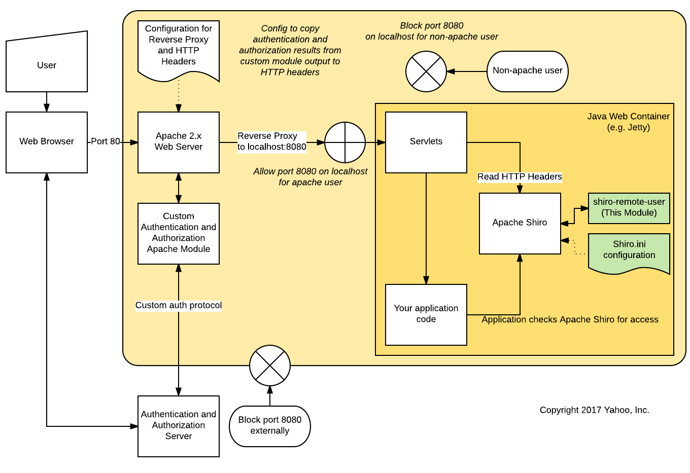

# shiro-remote-user

Shiro-remote-user is an example integration between Apache Shiro <abbr title="Autentication, Authorization, and
Access">AAA</abbr> framework and an upstream HTTP header authentication and authorization system.

You might use Shiro-remote-user if you are configuring an application that uses Shiro for its AAA interface, and want to
defer to an Apache Reverse-Proxy front end that handles Authentication and Authorization.  You can then configure the
per-URL Access Control in the Shiro.ini file.

Shiro-remote-user has been succesfully tested with [Apache Zeppelin](http://zeppelin.apache.org).

Shiro-remote-user is based on the tutorials [Securing Web Applications with Apache
Shiro](http://shiro.apache.org/webapp-tutorial.html) and [Shiro JWT by Jaime
Martinez](https://github.com/panchitoboy/shiro-jwt)

## 1. Configure Shiro to use Shiro Remote User

Assuming you have an application that already uses Shiro, you need only place the
`shiro-remote-user-0.0.1-SNAPSHOT.jar` file in the application's `lib` directory and configure
Shiro to refer to it.

In this example configuration, the upstream authentication places the authenticated user name in the
`X-Remote-User` header, and the user's role in the `X-Remote-Roles` header.

The configuration below, extracted from [shiro.ini.example](docs/shiro.ini.example) requires authenticated access for all
URLs except for `/api/version`, which is declared first, for precedence.

`.remoteUserHeaderName` is required for Authentication.  It specifies the name of the HTTP header whose value is the
authenticated user name.

`.remoteRolesHeaderName` is optional; if provided, it enables Role-based Authorization, subject to the following two
additional configuration parameters.

`.remoteRolesSeparator` is optional for Authorization.  If not provided, the Roles header value is converted to a single
Shiro Role.  If `.remoteRolesSeparator` is provided, it is the separator between Roles in the Roles header.  If the
separator contains whitespace or is empty, use double quotes around it.  If the result string is empty, the Roles header
value is converted to a set of one-character roles.  In all cases, leading and trailing whitespace is trimmed from the
resulting Roles.

<pre>
[main]

remoteUserFilter = com.yahoo.shiro.remoteuser.filter.RemoteUserAuthenticationFilter
remoteUserFilter.remoteUserHeaderName = X-Remote-User
remoteUserFilter.remoteRolesHeaderName = X-Remote-Roles
remoteUserFilter.remoteRolesSeparator = ","
remoteUserRealm = com.yahoo.shiro.remoteuser.realm.RemoteUserRealm
securityManager.realms = $remoteUserRealm

[urls]
/api/version = anon
/** = remoteUserFilter
</pre>

## 2. Build and install

Shiro-Remote-User uses Maven for build and dependency management.

Below is an example of how to deploy Shiro-Remote-User into [Apache Zeppelin](https://zeppelin.apache.org), assuming it has been configured above.

```
$ mvn clean package; cp target/shiro-remote-user-0.0.1-SNAPSHOT.jar /path/to/zeppelin-0.6.2-bin-all/lib/
```

## Apache Web Server Integration

In one common use case, a custom Apache module provides Authentication and Authorization on HTTP requests, and makes the
results available as environment variables.  The following Apache Web Server stanza copies those values to HTTP headers.
The HTTP header names used here must match the `remoteUserHeaderName` and `remoteRolesHeaderName` in the `shiro.ini` file.

```
<IfModule mycookieauthsso.c>
  <Location "/">
    MyCookieAuth on
  </Location>
  <VirtualHost *:*>
   RequestHeader set X-Remote-User "%{.myuser}e" env=.myuser
   RequestHeader set X-Remote-Roles "%{.myroles}e" env=.myroles
   ProxyPass        /ws ws://127.0.0.1:8080/ws
   ProxyPassReverse /ws ws://127.0.0.1:8080/ws
   ProxyPass        /   http://127.0.0.1:8080/
   ProxyPassReverse /   http://127.0.0.1:8080/
  </VirtualHost>
</IfModule>
```

## Server Configuration
Run the apache web server front end on the same server as the Shiro-enabled application server (e.g. Jetty) and use
network rules to prevent external access to the Jetty server port.  You may also want to use network rules to
prevent local access to the Jetty server port except for the apache web server user.

See the following diagram for an example:



## Security Review
Shiro-Remote-User is example code, and has not yet received security review.  Use at your own risk.

## Copyright
Copyright 2017, Yahoo Inc.

## License
Shiro-Remote-User is released under Apache 2.0 License.  See [LICENSE](LICENSE).

## Authors
shiro-remote-user was written by Leigh Klotz <klotz@klotz.me>.
Shiro-remote-user is based on the tutorials [Securing Web Applications with Apache
Shiro](http://shiro.apache.org/webapp-tutorial.html) and [Shiro JWT by Jaime
Martinez](https://github.com/panchitoboy/shiro-jwt)

## TODO
- Better Unit Tests ;-(
